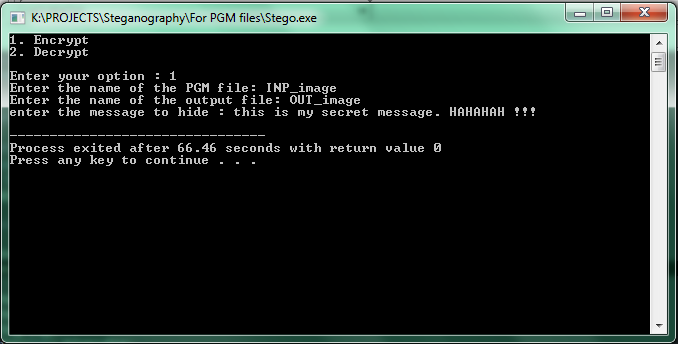
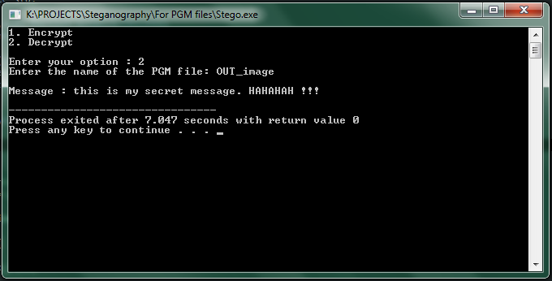

# Steganographer

Use it to encrypt your secret message in an image and also to decrypt and get back the hidden message from an image.

### Instructions on how to use :

#### For PGM image files

1. #### Encryption

   * Run the file stego.cpp using any C++ compiler.
   * Enter 1 to encrypt.
   * Enter the name of the image in which you want to encrypt the message. In this case, it is INP_image
   * Enter the name of the output image file. You can give it any name you want.
   * Finally, enter your secret message.

   

 

2. #### Decryption 

   * Run the file stego.cpp using any C++ compiler.
   * Enter 2 to decrypt.
   * Enter the name of the image which you want to decypt.
   * Finally, you get back the encrypted message.

 

 

**Currently working on encrypting JPG image files also.**

### Have fun using steganographer. 